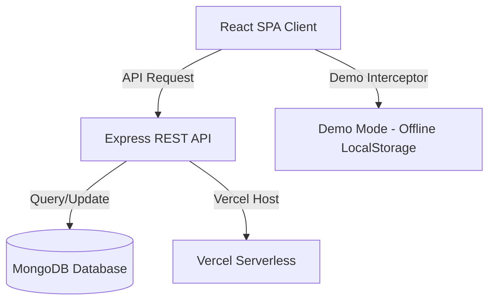

# Retrieval Co. — Campus Lost & Found and Borrowing Platform

> [!IMPORTANT]
> ### 🚧 Current Status
> Demo Mode is provided to allow recruiters and reviewers to explore all functionality without requiring backend configuration. The original authentication implementation remains available in the codebase.

---

## 📖 The Project Story

**Retrieval Co.** was built during a campus hackathon to solve the fragmented Lost & Found and temporary equipment borrowing process on college campuses. Previously, students had to dig through messy, noisy WhatsApp groups, Slack channels, and notices to find lost keys, misplaced IDs, or request an engineering drafter. 

This application centralizes reporting, searching, and borrowing under a single, unified campus portal. It introduces **AI-assisted post creation** (using smart NLP parsing), **loss hotspot maps**, **dual-scan secure QR handoffs**, and gamifies community participation using student **Karma points** to establish trust.

---

## ⚡ 30-Second Quick Summary

* **❓ What problem does this solve?** Centralizes and secures the chaotic campus Lost & Found and temporary equipment borrowing processes.
* **❓ What technologies were used?** React, Vite, Tailwind CSS, Node.js, Express.js, MongoDB (Mongoose), and Vercel.
* **❓ How do I run it?** Run `npm install` and `npm run dev` in `retrieval-co-frontend/`.
* **❓ Can I try it without setting up a backend?** Yes! Launch the app, navigate to `/login`, and click **⚡ Continue as Demo User** to explore all features instantly in serverless/offline mode.
* **❓ What features does it have?** Lost & Found listings, equipment borrow requests, AI NLP post auto-fills, loss hotspot heatmaps, secure QR return confirmation, and student Karma leaderboards.
* **❓ What did the developers learn?** Structuring a single-deployment monorepo on Vercel, intercepting fetch requests at the client level, and managing transient state effectively.

---

## 🏗️ System Architecture



To learn more about request routing and deployment configurations, see [Architecture.md](file:///docs/Architecture.md) and [SYSTEM_DESIGN.md](file:///docs/SYSTEM_DESIGN.md).

---

## 🛠️ Engineering Highlights

* **Offline-Ready Recruiter Demo Mode**: Designed a client-side API mock interceptor that wraps `window.fetch` to support full app functionality (post creation, updates, replies, QR confirmation) database-free.
* **Unified Serverless Monorepo**: Deployed Express backend routes as Vercel serverless functions directly alongside the React static client, serving both from the same origin.
* **Secure Verification System**: Implemented a dual-scan QR handoff system using time-limited JWT session tokens to prevent double karma claims.
* **Structured UI Design**: Crafted a dark, responsive dashboard using custom color mappings and micro-animations to enhance visual consistency and usability.

---

## 📁 Repository Layout

To view the complete folder layout and file descriptions, see [PROJECT_STRUCTURE.md](file:///PROJECT_STRUCTURE.md).

* [retrieval-co-frontend/](file:///retrieval-co-frontend/) — Unified React Client & Vercel serverless Express API.
* [retrieval-co-backend/](file:///retrieval-co-backend/) — Decoupled Express API reference for standalone development.
* [docs/](file:///docs/) — Comprehensive architectural and API documentation.
* [tests/](file:///tests/) — Automated integration test scripts.

---

## 💻 Local Setup & Installation

### Option A: Running with Demo Mode (Offline / Database-free)
1. Navigate to the frontend directory:
   ```bash
   cd retrieval-co-frontend
   ```
2. Install dependencies:
   ```bash
   npm install
   ```
3. Run the development server:
   ```bash
   npm run dev
   ```
4. Open `http://localhost:5173/` in your browser. Click **Launch Dashboard**, then click **⚡ Continue as Demo User**.

### Option B: Running with a Live Backend (MongoDB)
1. Open a terminal and run the Express API:
   ```bash
   cd retrieval-co-backend
   ```
2. Set up your `.env` variables:
   ```bash
   cp .env.example .env
   # Edit .env and supply your MONGO_URI and JWT_SECRET keys
   ```
3. Install dependencies and seed the database:
   ```bash
   npm install
   npm run seed
   ```
4. Run the backend:
   ```bash
   npm start
   ```
5. In another terminal, boot the frontend and make sure `demo_mode` is set to `false` in LoginPage.

---

## 🚀 Releases & Versions

* **v1.1.0 (Portfolio Edition)**: Current release. Added Demo Mode, client-side persistence, handoff simulations, global Footer, and thorough system design documents.
* **v1.0.0 (Hackathon Submission)**: Original prototype code submitted during the campus hackathon.

---

## 👥 Contributors

* **Abhijit** (Lead Full Stack Developer & GitHub Maintainer)
