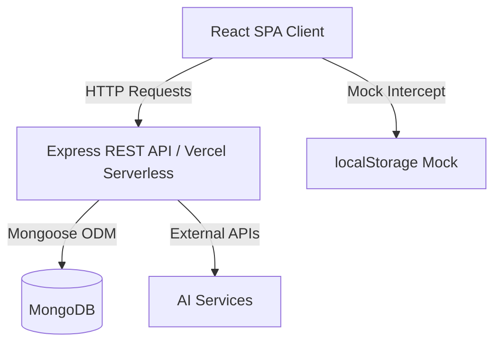
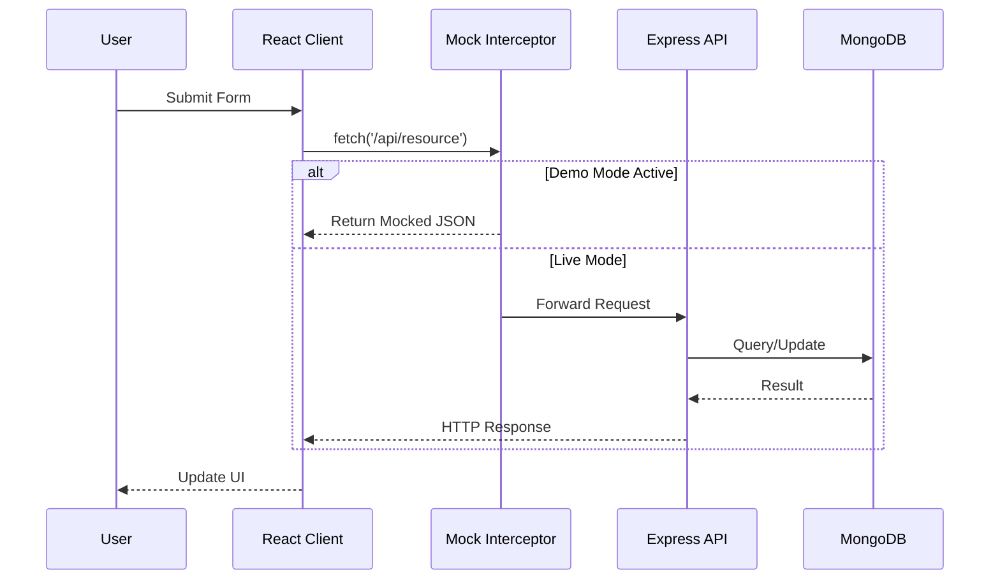
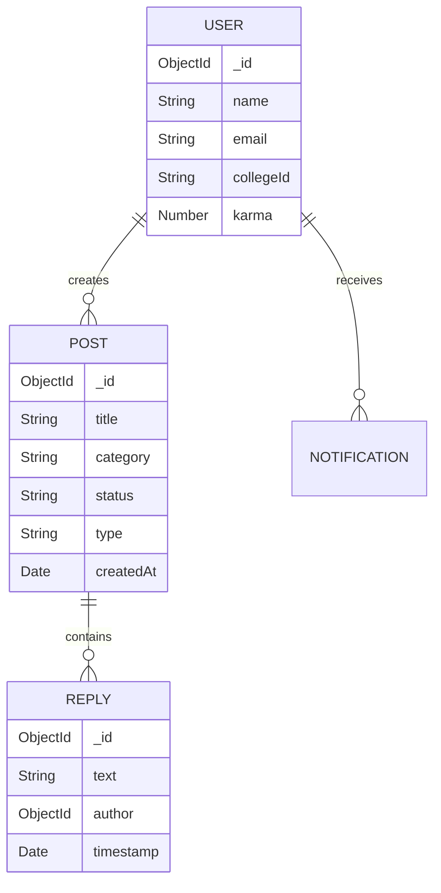
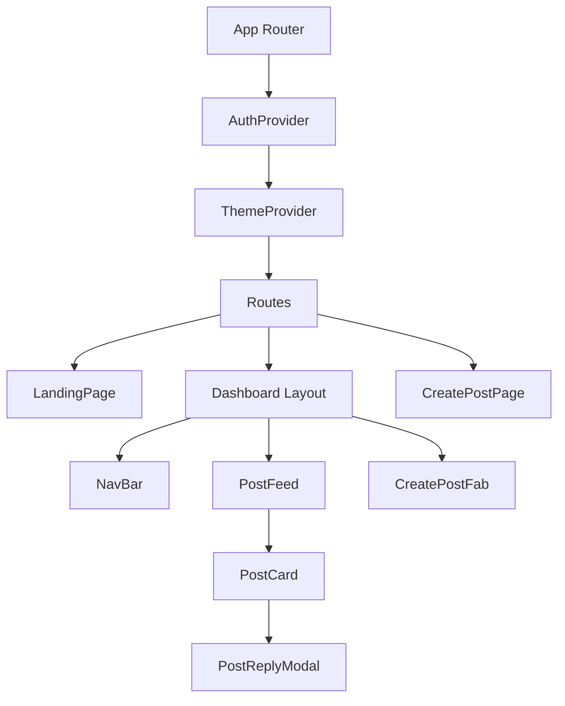
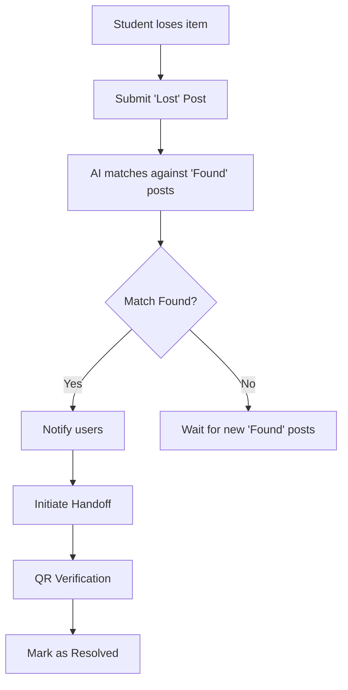
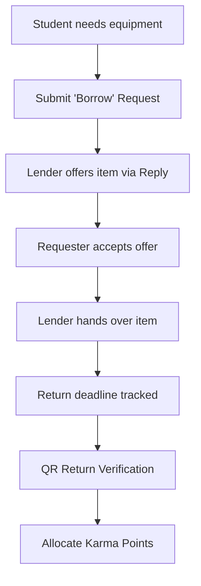
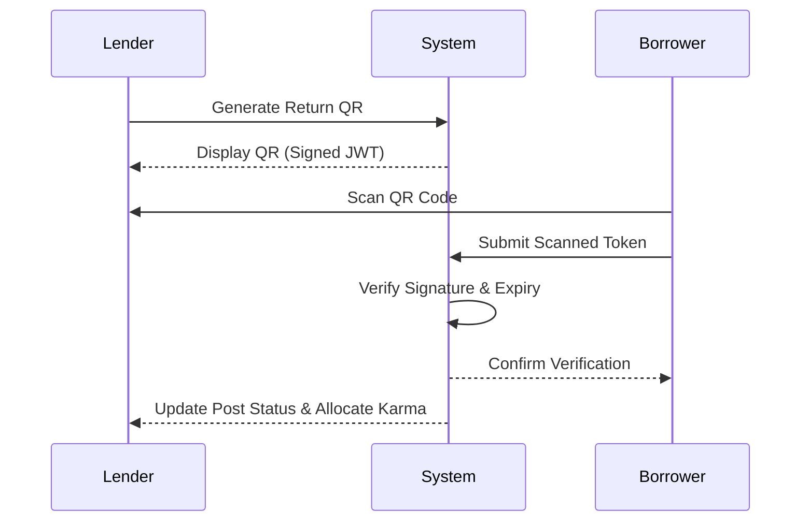

# Retrieval Co.

Retrieval Co. is a centralized campus portal for managing lost and found items and temporary equipment borrowing. It was built to solve the fragmentation of campus communications, providing students and administration with a single, verifiable system for item recovery and resource sharing.


## Demo

- **Live Application:** https://retrieval-co.vercel.app/
- **Demo Mode:** Click `⚡ Continue as Demo User` on the login screen to explore the application using the client-side mock interceptor.


## Problem Statement

Campus lost and found systems rely heavily on fragmented communication channels, such as WhatsApp groups, Slack channels, and physical notice boards. This fragmentation leads to:
- High difficulty in searching for historical messages about lost items.
- Lack of accountability when temporarily borrowing high-value equipment (e.g., engineering drafters, lab coats).
- Redundant administrative overhead for campus staff trying to track found items.

## Solution

Retrieval Co. consolidates item reporting and equipment borrowing into a single application. It introduces structured data collection for item attributes, automated similarity matching to connect lost and found reports, and a cryptographically verifiable handoff process using QR codes to ensure accountability.

## Features

###  Lost & Found
Standardized reporting for lost or found items, capturing essential metadata (location, time, category, and visual evidence).

###  Borrowing
A dedicated workflow for students to request or lend temporary academic equipment. Includes automated scheduling and return deadline tracking.

###  AI Assisted Posting
Integrates natural language processing to parse unstructured user input into structured form data, reducing friction during item reporting.

###  AI Matching
Calculates similarity between lost item reports and found item inventory to automatically suggest potential matches to users.

### 📱 QR Return Workflow
Utilizes time-based JSON Web Tokens (JWT) embedded within QR codes. Both parties must securely verify the transfer of an item to ensure non-repudiation. The system dynamically determines the Receiver and Giver based on the post type:
- **LOST Post:** Author (Owner) generates the QR to confirm receipt; Replier (Finder) scans it to get Karma.
- **FOUND Post:** Replier (Owner) generates the QR to confirm receipt; Author (Finder) scans it to get Karma.
- **BORROW Post:** Replier (Lender) generates the QR to confirm receipt; Author (Borrower) scans it to prove they returned it.

###  Campus Hotspots
Aggregates geographical data from lost item reports to render a heatmap of frequent loss locations on campus.

###  Leaderboard
Incentivizes positive community behavior by tracking successful returns and attributing metric-driven scores to users.

### ⚡ Demo Mode
A client-side interceptor that mocks API responses via `localStorage`, enabling comprehensive application review without requiring backend deployment.

## Architecture

### High-Level Architecture


### Request Flow


### Database Entity Relationship (ER) Diagram


### Component Hierarchy


## Workflows

### Lost Item Workflow


### Borrow Workflow


### QR Return Flow


## Tech Stack

| Layer | Technology | Purpose |
| :--- | :--- | :--- |
| **Frontend** | React, Vite, Tailwind CSS | UI rendering, build tooling, and responsive styling. |
| **Backend** | Node.js, Express.js | REST API routing and business logic execution. |
| **Database** | MongoDB, Mongoose | NoSQL data persistence and object data modeling. |
| **Deployment** | Vercel | Monolithic deployment utilizing Serverless Functions for API routes. |
| **Authentication**| JWT (JSON Web Tokens) | Stateless session management and secure route protection. |
| **State Management** | React Context API | Global state management for user authentication and theming. |
| **AI** | External NLP | Processing unstructured inputs into formatted metadata. |
| **Maps** | MapBox / Leaflet | Rendering geospatial heatmaps of loss locations. |
| **QR** | HTML5 QR Scanner | Client-side optical recognition for secure handoffs. |

## Project Structure

```text
retrieval-co/
├── docs/                        # Architectural documentation and specifications
├── retrieval-co-frontend/
│   ├── api/                     # Vercel serverless function entry points
│   ├── controllers/             # Express.js request handlers and business logic
│   ├── models/                  # Mongoose database schemas
│   ├── routes/                  # API route definitions
│   ├── src/                     # React frontend source code
│   │   ├── components/          # Reusable UI components (buttons, modals, cards)
│   │   ├── config/              # API configurations and offline mock interceptor
│   │   ├── context/             # React Context providers (Auth, Theme)
│   │   ├── pages/               # Top-level route components
│   │   └── utils/               # Helper functions and formatting tools
│   ├── package.json             # Combined dependencies for client and serverless build
│   └── vercel.json              # Deployment configuration and API path rewriting
```

### Directory Rationale
The repository utilizes a unified structure where Express backend logic resides alongside the React frontend. This satisfies Vercel's Serverless deployment model, allowing `vercel.json` to route `/api/*` requests directly to backend controllers without maintaining separate continuous integration pipelines.

## Engineering Highlights

- **Component-Based Architecture:** Decomposed the UI into reusable components, minimizing prop-drilling by leveraging Context for global state (Authentication, Theming).
- **REST API Design:** Designed clear, stateless API endpoints prioritizing resource-oriented URLs and standard HTTP methods.
- **Offline Demo Mode:** Implemented a robust `fetch` interceptor intercepting network requests at the client level. This allows reviewers to experience CRUD operations without database connectivity.
- **Modular Folder Structure:** Separated concerns between routing, controller logic, and database schemas strictly within the backend implementation.
- **Secure QR Workflow:** Secured item handoffs using short-lived JWTs encoded into QR codes, preventing replay attacks or fraudulent metric farming.

## Challenges

- **Deploying Full Stack on Vercel:** Migrating from a traditional stateful Node.js server to Vercel's stateless Serverless Functions required adapting the Express application entry point and restructuring dependency management.
- **Handling Asynchronous API Requests:** Synchronizing local React state with asynchronous API mutations (especially when dealing with the mock interceptor's simulated latency) required careful dependency management and optimistic UI updates.
- **Database Connectivity:** Managing MongoDB connection pooling within serverless environments where execution contexts are rapidly created and destroyed.
- **State Synchronization:** Ensuring the client accurately reflected data changes across nested modal components without introducing infinite re-renders.

## Running Locally

### Option A: Demo Mode (Offline)
1. Clone the repository and navigate to the frontend directory:
   ```bash
   cd retrieval-co-frontend
   ```
2. Install dependencies:
   ```bash
   npm install
   ```
3. Start the Vite development server:
   ```bash
   npm run dev
   ```
4. Access `http://localhost:5173`. Select **Continue as Demo User** to utilize the offline mock API.

### Option B: Live Backend Setup
1. Duplicate the environment template:
   ```bash
   cp retrieval-co-frontend/.env.example retrieval-co-frontend/.env
   ```
2. Populate `.env` with a valid `MONGO_URI` and `JWT_SECRET`.
3. Start the Express server and Vite client concurrently:
   ```bash
   cd retrieval-co-frontend
   npm run dev
   # In a separate terminal session:
   node server.js
   ```
*(Ensure demo mode is disabled in the client configuration to utilize live API routes).*

## Documentation

- [System Design](docs/SYSTEM_DESIGN.md)
- [Architecture](docs/Architecture.md)
- [API Reference](docs/API.md)
- [Project Structure](docs/PROJECT_STRUCTURE.md)
- [Product Requirements](docs/Retrieval_Co_PRD.md)
- [Design Specifications](docs/RetrievalCo_Design_Spec.md)
- [Future Roadmap](docs/FutureRoadmap.md)

## Future Improvements

- **OAuth Integration:** Replace standard JWT authentication with verified university SSO providers to ensure platform exclusivity.
- **Push Notifications:** Integrate Service Workers for real-time mobile updates when AI detects a potential match.
- **Cloud Storage:** Migrate image uploads from local buffering to scalable AWS S3 buckets.
- **Better AI:** Fine-tune NLP extraction parameters to increase matching precision on obscure descriptions.
- **Admin Dashboard:** Provide campus security with a high-level overview of unresolved reports.
- **Analytics:** Track item recovery times and user engagement metrics.

## Contributing

Please review the [CONTRIBUTING.md](CONTRIBUTING.md) file for details on our code of conduct and the process for submitting pull requests. Ensure all modifications follow the repository formatting standards and pass local ESLint checks.

## License

This project is licensed under the [MIT License](LICENSE).
