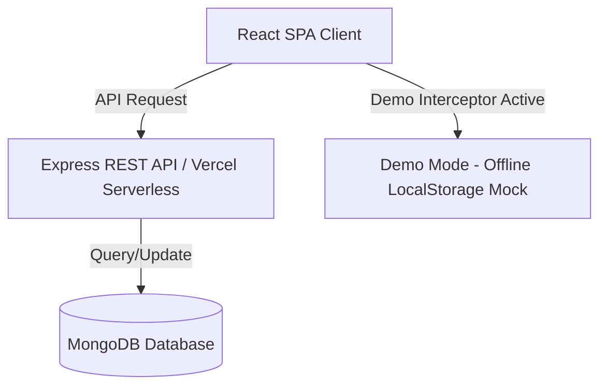

# Retrieval Co. — Campus Lost & Found and Borrowing Platform

> [!IMPORTANT]
> ### 🚧 Recruiter / Reviewer Demo Mode
> To explore all functionality instantly without setting up a database or backend environment, launch the app and click **⚡ Continue as Demo User**. The application features an offline mock-interceptor that enables you to create posts, reply, and test QR secure returns without an active server connection.

---

## ⚡ 30-Second Quick Summary

* **❓ What is this?** A centralized, secure web application for college campuses to manage Lost & Found items and temporary equipment borrowing (e.g., engineering drafters, lab coats).
* **❓ Who is it for?** University students and administration seeking to replace fragmented, noisy WhatsApp/Slack groups with a unified, gamified campus portal.
* **❓ Why was it built?** To solve the chaotic process of finding lost items on campus, establishing a trusted network via student Karma points, and ensuring secure item handoffs.
* **❓ How do I run it?** Clone the repo, navigate to `retrieval-co-frontend`, run `npm install` followed by `npm run dev`.
* **❓ Can I try it immediately?** Yes. Use the built-in **Demo Mode** on the login screen to bypass authentication and database requirements.
* **❓ What technologies were used?** React, Vite, Tailwind CSS, Express.js (deployed as Vercel serverless functions), MongoDB (Mongoose).
* **❓ What engineering challenges were solved?** 
  * Structuring a single-deployment monorepo on Vercel.
  * Intercepting `window.fetch` at the client level for a seamless offline demonstration experience.
  * Securing temporary handoffs using time-limited JWT session tokens encoded into QR codes.

---

## 🏗️ System Architecture



To learn more about request routing and deployment configurations, see the documentation inside the `/docs` folder.

---

## 🛠️ Engineering Highlights

* **Offline-Ready Recruiter Demo Mode**: Designed a robust client-side API mock interceptor that wraps `window.fetch`. It supports full application functionality (CRUD operations, replies, QR confirmation) entirely database-free, allowing for instant portfolio reviews.
* **Unified Serverless Monorepo**: Deployed Express backend routes as Vercel serverless functions directly alongside the React static client (`/api` rewrites in `vercel.json`), serving both from the same origin to eliminate CORS complexity and reduce deployment overhead.
* **Secure Verification System**: Implemented a dual-scan QR handoff system to verify returns and borrowings securely, preventing fraudulent Karma point farming.
* **Dynamic Client-Side UI**: Crafted a responsive, dark-mode dashboard featuring skeleton loaders, micro-animations, and fluid layout shifts utilizing Tailwind CSS.

---

## 📁 Repository Structure

The application is structured as a unified monorepo for seamless Vercel deployment. 

* `retrieval-co-frontend/src/` — React frontend SPA components, hooks, pages, and API configurations.
* `retrieval-co-frontend/api/` — Vercel serverless function entry points mapping to Express routes.
* `retrieval-co-frontend/controllers/` & `routes/` — Express backend logic, models, and middleware.
* `docs/` — Architectural and API documentation.

> Note: For development clarity, business logic and API endpoints remain physically decoupled inside the `/retrieval-co-frontend` root, even though they share the same deployment configuration.

---

## 💻 Local Setup & Installation

### Option A: Instant Demo Mode (Database-free)
1. Clone the repository and navigate to the root directory:
   ```bash
   cd retrieval-co-frontend
   ```
2. Install dependencies:
   ```bash
   npm install
   ```
3. Run the Vite development server:
   ```bash
   npm run dev
   ```
4. Open `http://localhost:5173/` in your browser. Click **Launch Dashboard**, then click **⚡ Continue as Demo User**.

### Option B: Live Backend Integration (MongoDB)
If you wish to run the full stack with an active database connection:
1. Navigate to `retrieval-co-frontend` and set up your `.env` variables:
   ```bash
   cp .env.example .env
   # Edit .env and supply your MONGO_URI and JWT_SECRET keys
   ```
2. Ensure you bypass the `mockFetch.js` interceptor by creating a non-demo user or modifying `App.jsx` to disable mock routing.
3. The Express routes can be served locally by running `node server.js` from the frontend directory.

---

## 🚀 Future Roadmap

- **Push Notifications:** Implementing Service Workers for real-time mobile updates when a lost item matches an AI description.
- **SSO Integration:** Connecting the authentication layer to official University OAuth providers for verified `.edu` student access.
- **Repository Splitting:** For extreme scale, separating the monolithic Vercel deployment into a distinct static frontend CDN and a containerized backend microservice architecture.

---

## 🚀 Releases & Versions

* **v1.1.0 (Portfolio Edition)**: Current release. Added Demo Mode, client-side persistence, handoff simulations, global Footer, and thorough system design documents.
* **v1.0.0 (Hackathon Submission)**: Original prototype code submitted during the campus hackathon.

---

## 👥 Contributors

* **Abhijit** (Lead Full Stack Developer & GitHub Maintainer)
