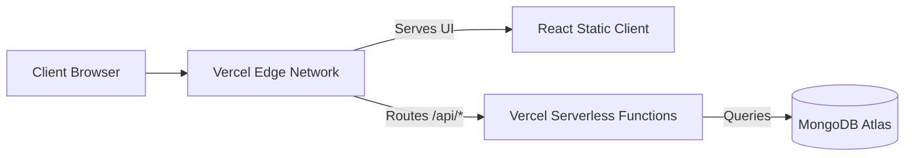
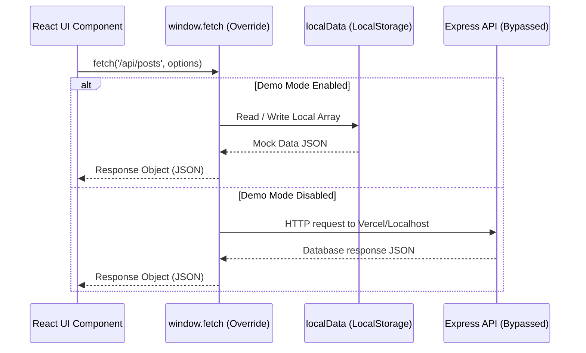

# Architecture Overview

This document describes the high-level architecture, deployment layout, and request flows of **Retrieval Co.**

---

## 1. Physical Architecture

Retrieval Co. is deployed as a single unified MERN project on **Vercel**:



---

## 2. Serverless Routing Configuration

In serverless environments, running a standard Express application requires wrapping it inside a serverless function handler. We achieve this using `vercel.json` and a serverless entry point:

1. **Routing Rules (`vercel.json`)**:
   Rewrites all calls matching `/api/(.*)` to `/api/index.js`.
2. **Serverless Hook (`retrieval-co-frontend/api/index.js`)**:
   ```javascript
   const app = require('../server.js');
   module.exports = app;
   ```
3. **Conditioned Listener (`server.js`)**:
   Express only opens a local socket listener (`app.listen()`) when NOT in production environments:
   ```javascript
   if (process.env.NODE_ENV !== 'production') {
       app.listen(PORT, () => console.log(`Server on port ${PORT}`));
   }
   ```

---

## 3. Demo Mode Interceptor Architecture

When Demo Mode is enabled, requests bypass the network stack entirely:


