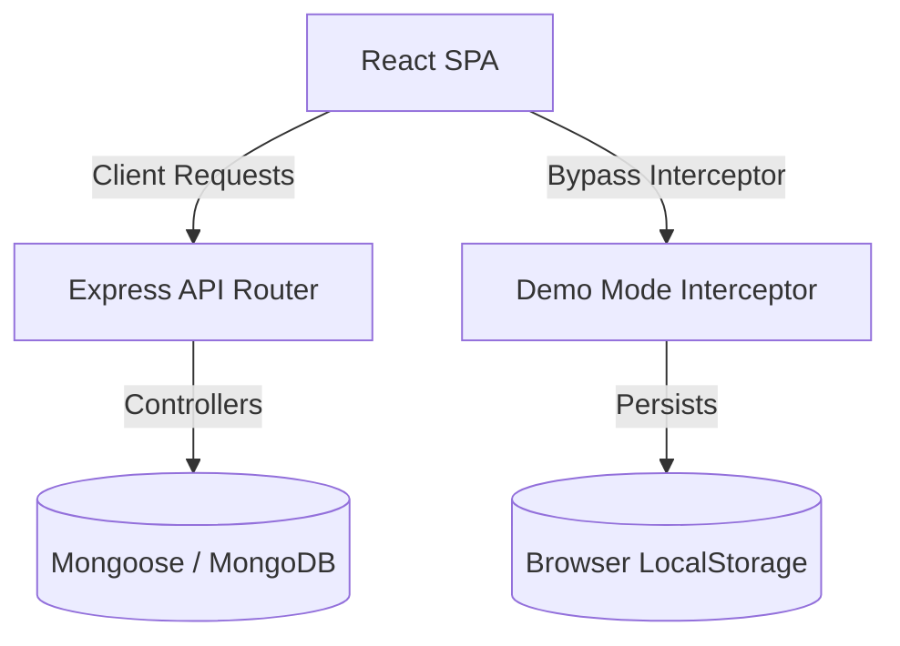

# System Design

This document details the architectural layout, data flow, schemas, and state management of **Retrieval Co.**

---

## 1. System Components

The application is structured into three layers:



* **Client Application**: React 19 SPA bundled with Vite and Tailwind CSS.
* **Server Middleware**: Node.js + Express.js API exposed as Vercel Serverless Functions.
* **Database Engine**: MongoDB (Mongoose Schema Driver) or in-memory mock JSON store.

---

## 2. Request & Authentication Flow

When a request is made in the application:

1. **Authorization Attachment**:
   Frontend's central `apiFetch` helper attaches the local storage JWT token:
   ```javascript
   const token = localStorage.getItem('token');
   const headers = token ? { 'Authorization': `Bearer ${token}` } : {};
   ```
2. **Backend Authentication Guard**:
   `authMiddleware` extracts and verifies the bearer token. On success, it binds the decoded payload onto `req.user`:
   ```javascript
   const decoded = jwt.verify(token, process.env.JWT_SECRET);
   req.user = decoded;
   ```

---

## 3. Database Schemas

### User Schema (`models/User.js`)
* `collegeId` (String, Unique): Registration or roll number of the student.
* `name` (String): Full student name.
* `email` (String): College institutional email.
* `karma` (Number): Trust points score (defaults to 100).
* `role` (String): User group (default: `student`).

### Post Schema (`models/Post.js`)
* `type` (String): Must be `lost`, `found`, or `borrow`.
* `title` (String): Short title of item.
* `category` (String): Group matching (e.g. `Electronics`, `ID Cards`).
* `description` (String): Details describing the item.
* `location` (String): Campus location where lost/found/needed.
* `datetime` (Date): Time of loss/finding.
* `imageUrl` (String): Link to proof photo.
* `status` (String): Current status (`open`, `resolved`, `returned`, `closed`).
* `isUrgent` (Boolean): Highlight flag.
* `needUntil` (Date): Valid for borrow posts.
* `author` (ObjectId -> User): Link to creator.
* `replies` (Array):
  * `user` (ObjectId -> User): Link to replier.
  * `text` (String): Reply message body.
  * `createdAt` (Date).

---

## 4. State Management & Theme Context

* **Authentication State**: Managed via React `AuthContext` to persist user credentials across sessions.
* **UI Themes**: Dark-mode primary layout mapped globally inside `ThemeContext`.
